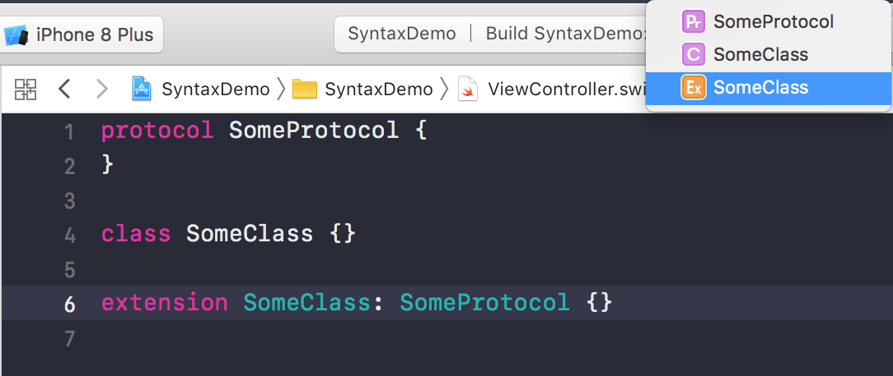
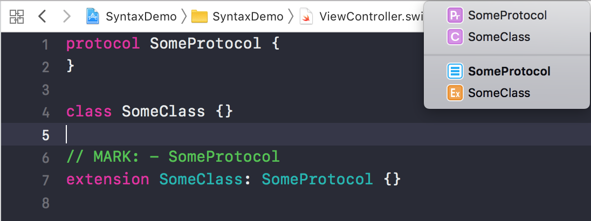

# Annotator

Annotator is a command line tool for annotating class extensions defined for protocol conformance. Adding these comments can ease navigation in source files (especially large ones), but can be quite cumbersome, so I decided to automate it.

Without annotation:



With annotation:



Annotator leverages Apple's [SwiftSyntax](https://github.com/apple/swift-syntax) package for parsing/changing the source code.

## Installation

Using Swift Package Manager:

```
$ git clone https://github.com/jozsef-vesza/Annotator
$ cd Annotator
$ swift build -c release -Xswiftc -static-stdlib
$ cp -f .build/release/Annotator /usr/local/bin/annotator
```

## Usage
```
$ annotator path_to_project_root_folder
```